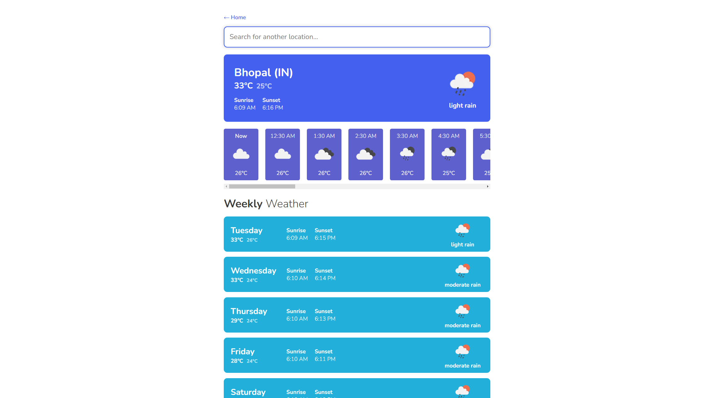

# Weather App - Next.js


## Description

The Weather App is a dynamic and responsive web application built using Next.js, designed to provide real-time and forecasted weather information for cities around the world. Leveraging the OpenWeatherMap API, the app delivers current weather conditions, hourly forecasts, and weekly predictions. Users can search for cities, view weather details, and explore weather data through a clean and intuitive interface.

### Features

- **Real-Time Weather Data**: Get up-to-date weather information including temperature, weather conditions, sunrise, and sunset times.
- **Hourly Forecast**: View detailed hourly weather forecasts to plan your day.
- **Weekly Forecast**: Check out the weather forecast for the upcoming week.
- **City Search**: Search for cities and view their weather data with autocomplete suggestions.
- **Popular Cities**: Quick access to weather information for popular cities.
- **Responsive Design**: Fully responsive and works seamlessly on both desktop and mobile devices.



## Technologies

- **Next.js**: React framework for server-side rendering and static site generation.
- **OpenWeatherMap API**: Provides weather data.
- **SCSS**: For styling the application.
- **Moment.js & Moment-Timezone**: For date and time formatting.
- **NProgress**: For route change progress indicators.

## Usage

- **Home Page**: Search for a city or explore popular cities to view their weather data.
- **City Weather Page**: Provides detailed current weather, hourly forecast, and weekly forecast for a specific city.

## Installation

To run this project locally, follow these steps:

1. **Clone the repository:**

   ```bash
    git clone https://github.com/abhishekcultivates/weather-app-nextjs.git
   ```

2. **Navigate to the project directory:**

   ```bash
    cd weather-app-nextjs
   ```

3. **Install Dependencies:**

   ```bash
    npm install
   ```

4. **Set up environment variables:**
   Create a .env.local file in the root directory and add your OpenWeatherMap API key:

   ```bash
    API_KEY=your_openweathermap_api_key
   ```

5. **Run the development server:**

   ```bash
    npm run dev
   ```
